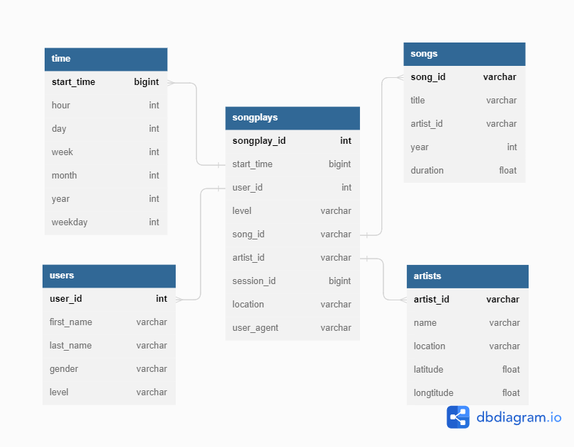

# Udacity Nanodegree Course [Data Engineer]

## Project: Data Modeling with Postgres

### Introduction

A startup called Sparkify wants to analyze the data they've been collecting on songs and user activity on their new music streaming app. The analytics team is particularly interested in understanding what songs users are listening to. Now, they have an easy way to query their data, which resides in a directory of JSON logs on user activity on the app, as well as a directory with JSON metadata on the songs in their app.

### Project Description

In this project, I have applied what I've learned on data modeling with Postgres and build an ETL pipeline using Python. To complete the project, I have defined fact and dimension tables for a star schema for a particular analytic focus, and written an ETL pipeline that transfers data from files in two local directories into these tables in Postgres using Python and SQL.

### Project Structure

- `test.ipynb` - displays the first few rows of each table to let you check the database.
- `create_tables.py` - drops and creates your tables. You run this file to reset your tables before each time you run your ETL scripts.
- `etl.ipynb` - reads and processes a single file from **song_data** and **log_data** and loads the data into tables.
- `etl.py` - reads and processes files from **song_data** and **log_data** and loads them into tables.
- `sql_queries.py` - contains all sql queries, and is imported into the last three files above.
- `README.md` - provides discussion on project.
- `data` - this folder contains **song_data** and **log_data** subfolders which contains Sparkify JSON data.

### How to Run

> **Note**: to run this ETL pipeline you need to make sure that you have created a database `studentdb` on your localhost that have a  user `student` with password `student`.

1. Run `create_tables.py` to create your database and tables.
    ```bash
    python create_tables.py
    ```
2. Run `etl.py` to read and process Sparkify files and loads them into tables.
    ```bash
    python etl.py
    ```
3. **[Optional]** You can test result by a `test.ipynb` to confirm the creation of your tables with the correct columns.

### Database Schema



##### Fact Table
- `songplays` - records in log data associated with song plays i.e. records with page NextSong

##### Dimension Tables
- `users` - users in the app
- `songs` - songs in music database
- `artists` - artists in music database
- `time` - timestamps of records in songplays broken down into specific units