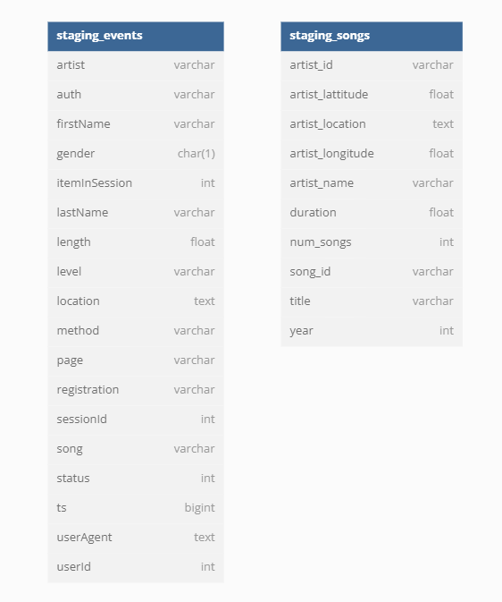
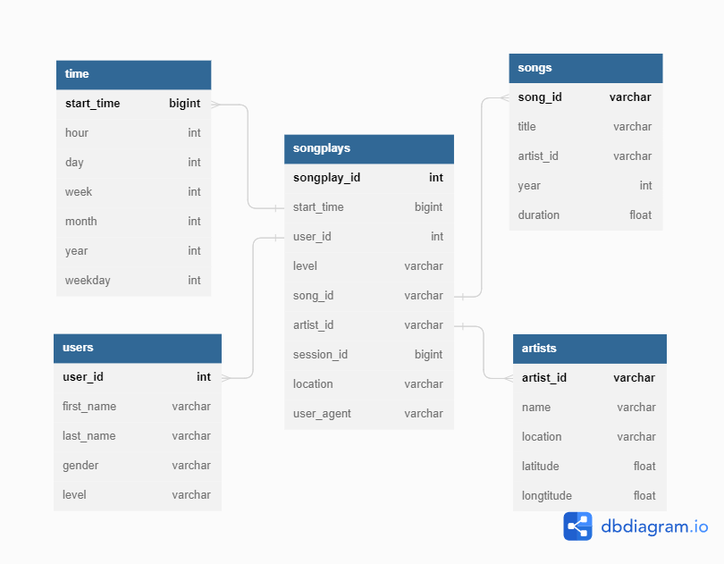

# Udacity Nanodegree Course [Data Engineer]

## Project: Data Warehouse

### Introduction

A startup called Sparkify wants to analyze the data they've been collecting on songs and user activity 
on their new music streaming app. The analytics team is particularly interested in understanding what songs 
users are listening to. Now, they have an easy way to query their data, which resides in a directory of JSON 
logs on user activity on the app, as well as a directory with JSON metadata on the songs in their app.

### Project Description

In this project, I've applied what I've learned on data warehouses and AWS to build an ETL pipeline 
for a database hosted on Redshift. I have loaded data from S3 to staging tables on Redshift 
and execute SQL statements that create the analytics tables from these staging tables.

### Project Structure

- `create_tables.py` - drops and creates your tables. You run this file to reset your tables before each time 
                       you run your ETL scripts.
- `dwh.cfg` - project config file.
- `etl.py` - reads and processes files from S3 bucket and loads them into tables.
- `sql_queries.py` - contains all sql queries, and is imported into the last three files above.
- `README.md` - provides discussion on project.

### How to Run

> **Note**: before running scripts you need to launch a redshift cluster and create an IAM role
> that has read access to S3 and add redshift database and IAM role info to `dwh.cfg`.

1. Run `create_tables.py` to create your database and tables.
    ```bash
    python create_tables.py
    ```
2. Run `etl.py` to read and process Sparkify files and loads them into tables.
    ```bash
    python etl.py
    ```

### Database Schema



##### Staging tables

- `staging_events` - contains raw log files data.
- `staging_songs` - contains raw song files data.



##### Fact Table
- `songplays` - records in log data associated with song plays i.e. records with page NextSong

##### Dimension Tables
- `users` - users in the app
- `songs` - songs in music database
- `artists` - artists in music database
- `time` - timestamps of records in songplays broken down into specific units